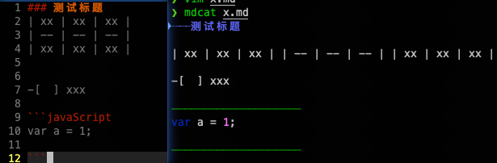

探索前端技术的无尽旅程从这里开始！每周精选前端领域的热门文章。文章方面，本期为大家带来 Node、Git 常用的技巧，在技术发展趋势上，探讨 Rust、Go、Node、Deno、Bun 多种技术在实际业务中的使用选择。工具方面，强推荐大家尝试一下 AI 提效工具。话不多说，详细内容请大家查阅。如果觉得有收获，动动大拇指点个赞，以示鼓励！
### 文章推荐
#### [NodeJS 的一些开发技巧与性能优化手段](https://medium.com/@Choco23/node-js-mastery-advanced-development-performance-tips-da07355c1e8a)
> 文章通过 Express 简单启动一个服务作为切入点，列举了常用的压力测试（[ab](https://httpd.apache.org/docs/2.4/programs/ab.html)、[webbench](http://home.tiscali.cz/~cz210552/webbench.html)、[autocannon](https://github.com/mcollina/autocannon)）、性能测试工具、debug工具（chrome devTool）。性能优化方面与内存管理，列举了一些常用的优化手段与内存管理方式。阅读大约 **6 分钟**，大家可以按需查漏补缺。

#### [十个你应该知道的 Git 命令](https://levelup.gitconnected.com/10-must-know-git-commands-for-software-engineers-ffc6687d6dfd)
> Git是每个软件工程师必须知道的最基本的东西。这些工具是开发人员日常工作不可或缺的一部分，因为我们每天都与他们互动。精通Git不仅可以简化您的生活，还可以显著提高工作效率。在这篇博文中，我们将探索一组可以提高你的工作效率的命令。随着您越来越熟练地使用这些命令，您将节省宝贵的时间，并成为一名更高效的软件工程师。其中 `git commit --amend -m 'msg'` 很适合笔者这种直接用上一次命令快速commit的提交后，但是又想要改一下commit 信息，使其更符合这次提交的信息，又不想再修改文件的情况下使用，可以直接将最后一次的 `commit` 信息进行修改。也比较适合一个需求最后阶段做个总结的 commit 信息补充。

#### [REST API 设计最佳实践](https://medium.com/@techworldwithmilan/rest-api-design-best-practices-2eb5e749d428)
> 想了解 REST API 设计的原则，可以看一下这篇文章。阅读大约 4 分钟，文章阐述了 10 条设计 REST API 的最佳实践。

#### [7 种”防御型编程“方式](https://medium.com/@Evelyn.Taylor/7-bad-ways-to-write-javascript-f41186f6dd05)
> 当我拿出“防御型编程代码”，请问阁下将如何应对。文章列举了 7 种在日程编写代码种容易出现的编码陋习，并给到了更优的写法。快来看看自己的代码是否是这 7 种防御型代码。

#### [2023 年最大技术分歧：选 Rust 还是 Go ？](https://mp.weixin.qq.com/s/QP69q7LYZMF7tvcrvj31gg)
> 在 Stack Overflow 2022 开发者调查中，对于“让人爱恨交织的编程语言”这个问题，在 7 万份回复中，程序员们明显也更为偏爱 Rust，86% 的人表示喜欢 Rust，而 64% 的人表示喜欢 Go。面对 Rust 的火爆现状，一些开发者发出了灵魂提问：2023 年，Go 还值得学习吗？

> 笔者选 **rust**！哈哈哈哈哈哈哈！

#### [2024 年你应该使用 Bun、NodeJS 还是 Deno？](https://mp.weixin.qq.com/s/ygHeG3HDGdeBiuYF6v1Pdg)

> 对于你下一个重要的 JavaScript 项目，应该选择什么呢？嗯，事情并不那么简单。理解每个运行环境的优势和劣势是很重要的。因此，本文通过比较 Bun、NodeJS 和 Deno，深入探讨它们的优点、缺陷等方面。

简单总结一下三者优缺点

| 优缺点 | NodeJS                                                     | [Deno](https://github.com/denoland/deno)   | [Bun](https://github.com/oven-sh/bun)              |
| --- | ---------------------------------------------------------- | ------------------------------------------ | -------------------------------------------------- |
| 优点  | 1. 非阻塞 I/O 和可伸缩性提供了更高的性能 2. 成熟的生态系统，拥有众多的库和框架 3.庞大而活跃的社区支持 | 1. 安全性高 2. 天然支持 TS，开发体验更优 3. 通过 URL 简化模块管理 | 1. 学习曲线低，Bun 是一个全能的工具包 2. 使用JavaScriptCore 引擎，性能更高 |
| 缺点  | 1.单现成特性存在性能瓶颈，不适合CPU密集型任务 2. 容易陷入异步编程回调地狱                  | 1. 生态不成熟 2. 三方库可用性有限                       | 1. 社区支持有限，属于新推出产品                                  |

那么实际项目中，怎么选择技术方案？

-   **Node.js**：如果你更喜欢经过多年试验和测试的稳定可靠生态系统，那么这是首选的运行环境。
-   **Deno**：如果你优先考虑安全性和最新的编程环境特性，则建议使用 Deno。它还原生支持 TypeScript。
-   **Bun**：如果你需要高速度，特别是在使用 JavaScript 或 TypeScript 时，那么这个运行环境应该是你的首选。

> [Bun](https://github.com/oven-sh/bun) 作为一个新的轮子，并且荣获2023 最受欢迎第二名，可见社区对其的期待，想了解更新关于 [Bun](https://github.com/oven-sh/bun) 的信息，可查看[相关文档](https://juejin.cn/post/7277387014046335010)

### 工具推荐
#### [h5player](https://github.com/xxxily/h5player)
> 一个油猴视频增强脚本，支持所有H5视频网站，例如：B站、抖音、腾讯视频、优酷、爱奇艺、西瓜视频、油管（YouTube）、微博视频、知乎视频、搜狐视频、网易公开课、百度网盘、阿里云盘、ted、instagram、twitter等。全程快捷键控制，支持：倍速播放/加速播放、视频画面截图、画中画、网页全屏、调节亮度、饱和度、对比度、自定义配置功能增强等功能，为你提供愉悦的在线视频播放体验。还有视频广告快进、在线教程/教育视频倍速快学、视频文件下载等能力

#### [oxlint](https://oxc-project.github.io/blog/2023-12-12-announcing-oxlint.html)更快的 Lint 工具
> 比 eslint 快 50- 100 倍的 lint 工具正式发布。在真实测试场景下，Shopify 报告称，他们需要 75 分钟的 eslint 检测，在使用 oxlint 后，仅仅只发给 10 秒。简单易用，可以在没有配置文件的场景下，在项目根路径下运行 `npx oxlint@latest` 即可。但 oxlint 尚未提供插件系统，所以暂时不支持 `TypeScript、React、Jest、Unicorn、JSX-a11y` 和 `Import` 等流行插件的规则。

> 笔者建议：如果当前项目 Lint 耗时并不是效率瓶颈，可以先保持观望一波！

#### [mdcat](https://github.com/swsnr/mdcat)
> 一个可以在命令行显示 Markdown 文件渲染后的内容工具。体验了一下，能够识别部分语法，但是想表格、勾选框这一类的没有识别

#### [DOMPurify](https://github.com/cure53/DOMPurify) 专注于Dom 的 XSS 清除程序
> DOMPurify 专注于消除 HTML、SVG 和 MathML 中的潜在恶意代码，通过在将用户提供的内容插入到 DOM 之前，清理和净化这些内容来防范 XSS 攻击。相较于 [XSS](https://github.com/leizongmin/js-xss)在过滤 Dom 的场景下，[DOMPurify](https://github.com/cure53/DOMPurify) 要更快，但在处理一些特定场景（如处理纯字符串）时不如一些通用的  [XSS](https://github.com/leizongmin/js-xss) 过滤库灵活。简单来说，如果你主要关注在前端处理用户输入并防范 XSS，[DOMPurify](https://github.com/cure53/DOMPurify) 是一个强大的选择，尤其是在处理 DOM 内容方面。如果你需要通用的  [XSS](https://github.com/leizongmin/js-xss) 过滤功能，或者对性能要求不是特别严格，"xss" 包可能是一个更通用的选择。

#### [everyone-can-use-english](https://github.com/xiaolai/everyone-can-use-english)
> 一款使用 electron 创建的学习英语的软件。支持添加视频音频学习资料。同时还支持机器人对话翻译，单词本，打卡记录等多种功能。注意一点：启动项目后需要使用 [Mixin-Messenger](https://messenger.mixin.one/zh/download?platform=iOS) 进行登录，但是 [Mixin-Messenger](https://messenger.mixin.one/zh/download?platform=iOS)不支持国区，iOS 用户可以切换 AppStore 地区进行下载，笔者切换至土耳其下载成功，安卓用户可以使用 google-play 下载安装。
> 笔者在本地打包好了软件，不想本地启动项目的同学，可以直接点击下载[Enjoy-darwin-arm64-0.1.0-alpha.3.zip](https://ee-clodis.corp.kuaishou.com/s/1qGCTWyQ2TpnbFDQQ4cIzm)，打包版本对应commit：e1488f1f866a71fe3d5bea936ed06b77f2584a8f

#### [通过AI工具提升开发效率](https://hackernoon.com/ai-powered-tools-that-doubled-my-development-speed)
> 文章推荐了几款在日程开发过程中，能够提升我们开发效率的AI工具，如[Copilot](https://github.com/features/copilot?ref=hackernoon.com)、[GPT-Engineer](https://github.com/gpt-engineer-org/gpt-engineer?ref=hackernoon.com)、[Cody AI](https://github.com/sourcegraph/cody?ref=hackernoon.com)、[React Agent](https://github.com/eylonmiz/react-agent?ref=hackernoon.com)、[v0](https://v0.dev/?ref=hackernoon.com)、[Sweep AI](https://github.com/sweepai/sweep?ref=hackernoon.com)、[ScriptGPT](https://github.com/ukanwat/scriptgpt/?ref=hackernoon.com)
> **GPT 工程师即将崛起！🤣🤣🤣**

#### [everyone-can-use-english](https://github.com/xiaolai/everyone-can-use-english)
> 一款使用 electron 创建的学习英语的软件。支持添加视频音频学习资料。同时还支持机器人对话翻译，单词本，打卡记录等多种功能。注意一点：启动项目后需要使用 [Mixin-Messenger](https://messenger.mixin.one/zh/download?platform=iOS) 进行登录，但是 [Mixin-Messenger](https://messenger.mixin.one/zh/download?platform=iOS)不支持国区，iOS 用户可以切换 AppStore 地区进行下载，笔者切换至土耳其下载成功，安卓用户可以使用 google-play 下载安装。

#### [通过AI工具提升开发效率](https://hackernoon.com/ai-powered-tools-that-doubled-my-development-speed)
> 文章推荐了几款在日程开发过程中，能够提升我们开发效率的AI工具，如[Copilot](https://github.com/features/copilot?ref=hackernoon.com)、[GPT-Engineer](https://github.com/gpt-engineer-org/gpt-engineer?ref=hackernoon.com)、[Cody AI](https://github.com/sourcegraph/cody?ref=hackernoon.com)、[React Agent](https://github.com/eylonmiz/react-agent?ref=hackernoon.com)、[v0](https://v0.dev/?ref=hackernoon.com)、[Sweep AI](https://github.com/sweepai/sweep?ref=hackernoon.com)、[ScriptGPT](https://github.com/ukanwat/scriptgpt/?ref=hackernoon.com)
> **GPT 工程师即将崛起！🤣🤣🤣**